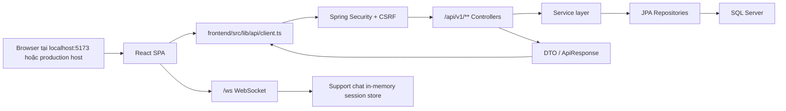
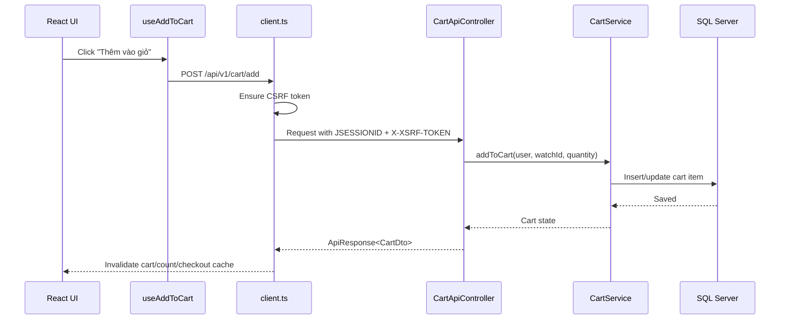
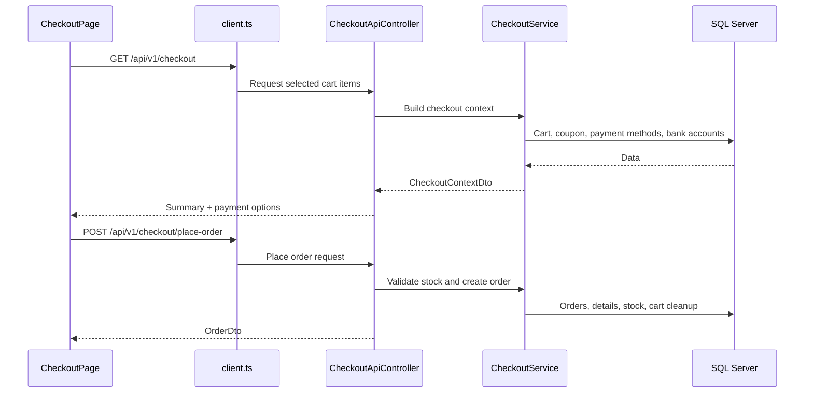

# 2BShop

2BShop là hệ thống thương mại điện tử bán đồng hồ, gồm backend Spring Boot và frontend React SPA. Dự án đã được chuyển từ Thymeleaf sang React, dùng API JSON dưới namespace `/api/v1/**`, giữ session authentication của Spring Security và phục vụ một artifact khi build production.

> Trạng thái hiện tại: UI public, user và admin chạy bằng React + Vite. Backend Spring Boot cung cấp REST API, WebSocket live chat, OAuth2, checkout, VNPay, upload ảnh và quản trị.

## Mục lục

- [Tính năng chính](#tính-năng-chính)
- [Công nghệ sử dụng](#công-nghệ-sử-dụng)
- [Kiến trúc tổng quan](#kiến-trúc-tổng-quan)
- [Cấu trúc thư mục](#cấu-trúc-thư-mục)
- [Yêu cầu môi trường](#yêu-cầu-môi-trường)
- [Cấu hình local](#cấu-hình-local)
- [Chạy dự án](#chạy-dự-án)
- [Build và đóng gói](#build-và-đóng-gói)
- [API và route chính](#api-và-route-chính)
- [Ghi chú bảo mật](#ghi-chú-bảo-mật)
- [Troubleshooting](#troubleshooting)

## Tính năng chính

### Storefront và tài khoản

- Trang chủ, danh mục sản phẩm, bộ sưu tập mới nhất, sản phẩm giảm giá và chi tiết sản phẩm.
- Tìm kiếm, lọc, phân trang và xem gallery ảnh sản phẩm.
- Đăng ký, xác thực email, đăng nhập bằng email/password và Google OAuth2.
- Hỗ trợ song ngữ Việt/Anh, đổi toàn bộ UI bằng một lần click.
- Live chat hỗ trợ trực tuyến theo session, không lưu DB.

### Giỏ hàng và đơn hàng

- Thêm sản phẩm vào giỏ, cập nhật số lượng, chọn từng item hoặc chọn tất cả.
- Checkout theo các item được chọn trong giỏ hàng.
- Áp dụng mã giảm giá, tính tổng tiền, phí vận chuyển và tiền cọc.
- Hỗ trợ COD, chuyển khoản ngân hàng và VNPay sandbox.
- Xem lịch sử đơn hàng, chi tiết đơn hàng và kết quả thanh toán.

### Admin

- Dashboard thống kê doanh thu, đơn hàng, sản phẩm và biểu đồ.
- Quản lý đồng hồ, thương hiệu, người dùng, đơn hàng, phương thức thanh toán, tài khoản ngân hàng và giao dịch.
- Upload ảnh sản phẩm và ảnh người dùng.
- Trang hỗ trợ trực tuyến để admin xem và trả lời các phiên chat đang còn sống.

## Công nghệ sử dụng

### Backend

| Nhóm | Công nghệ |
| --- | --- |
| Framework | Spring Boot 3.2.3 |
| Runtime | Java 21 |
| Security | Spring Security, OAuth2 Client, CSRF cookie/header |
| Database | SQL Server, Spring Data JPA, Hibernate |
| Realtime | Spring WebSocket, STOMP, SockJS |
| Email | Spring Mail |
| Payment | VNPay sandbox, COD, bank transfer |
| Document | Apache POI, OpenPDF |
| API docs | springdoc-openapi |

### Frontend

| Nhóm | Công nghệ |
| --- | --- |
| Framework | React 18 |
| Build tool | Vite 5 |
| Language | TypeScript |
| Routing | React Router 6 |
| Server state | TanStack Query 5 |
| Form | React Hook Form |
| Chart | Chart.js, react-chartjs-2 |
| Realtime client | STOMP.js, SockJS Client |
| UI | CSS variables, responsive layout, custom design system |

## Kiến trúc tổng quan



### Nguyên tắc hiện tại

- React chịu trách nhiệm toàn bộ UI public, user và admin.
- Spring Boot chỉ render SPA fallback hoặc redirect về frontend trong môi trường dev.
- Mọi dữ liệu động đi qua API JSON `/api/v1/**`.
- Auth vẫn dùng server-side session `JSESSIONID`.
- Mutation từ React gửi CSRF qua cookie/header.
- Live chat lưu trong memory theo `HttpSession`, tự mất khi logout, session timeout hoặc server restart.

## Cấu trúc thư mục

```text
BoizShop/
├── README.md
├── DESIGN.md
├── .editorconfig
├── .vscode/
└── 2BShop/
    ├── pom.xml
    ├── frontend/
    │   ├── package.json
    │   ├── vite.config.ts
    │   └── src/
    │       ├── app/
    │       ├── components/
    │       ├── features/
    │       │   ├── admin/
    │       │   ├── auth/
    │       │   ├── public/
    │       │   └── user/
    │       ├── hooks/
    │       ├── lib/
    │       ├── routes/
    │       └── styles/
    └── src/main/
        ├── java/boiz/shop/_2BShop/
        │   ├── api/
        │   ├── config/
        │   ├── controller/
        │   ├── dto/
        │   ├── entity/
        │   ├── enums/
        │   ├── respository/
        │   ├── security/
        │   └── service/
        └── resources/
            ├── application.properties.example
            ├── db/
            └── static/
```

## Yêu cầu môi trường

- Java 21
- Maven 3.8+ hoặc Maven wrapper nếu được bổ sung sau
- Node.js 20+ khuyến nghị
- npm 10+ khuyến nghị
- SQL Server 2019+ hoặc SQL Server Developer Edition
- Git

## Cấu hình local

### 1. Clone repository

```bash
git clone <repository-url>
cd BoizShop
```

### 2. Tạo file cấu hình backend

Không commit credential thật lên GitHub. File an toàn để tham khảo là:

```text
2BShop/src/main/resources/application.properties.example
```

Tạo file local:

```powershell
Copy-Item 2BShop/src/main/resources/application.properties.example 2BShop/src/main/resources/application.properties
```

Sau đó cập nhật các nhóm cấu hình sau:

```properties
server.port=8080
app.frontend.origin=http://localhost:5173

spring.datasource.url=jdbc:sqlserver://localhost:1433;databaseName=BShopDB;encrypt=true;trustServerCertificate=true
spring.datasource.username=YOUR_DB_USERNAME
spring.datasource.password=YOUR_DB_PASSWORD

spring.mail.username=YOUR_EMAIL@gmail.com
spring.mail.password=YOUR_GMAIL_APP_PASSWORD

vnpay.tmnCode=YOUR_VNPAY_TMN_CODE
vnpay.hashSecret=YOUR_VNPAY_HASH_SECRET
vnpay.returnUrl=YOUR_PUBLIC_TUNNEL_URL/payment/vnpay-return

spring.security.oauth2.client.registration.google.client-id=YOUR_GOOGLE_CLIENT_ID
spring.security.oauth2.client.registration.google.client-secret=YOUR_GOOGLE_CLIENT_SECRET
spring.security.oauth2.client.registration.google.redirect-uri=http://localhost:8080/login/oauth2/code/{registrationId}
```

### 3. Chuẩn bị database

Tạo database SQL Server:

```sql
CREATE DATABASE BShopDB;
```

Các script tham khảo nằm trong:

```text
2BShop/src/main/resources/db/
```

Khi chạy local, project đang dùng:

```properties
spring.jpa.hibernate.ddl-auto=update
```

Vì vậy Hibernate có thể tự cập nhật schema cơ bản theo entity. Với dữ liệu mẫu hoặc migration thủ công, dùng các file SQL trong thư mục `db`.

### 4. Google OAuth2 local

Trong Google Cloud Console, callback local cần giữ ở backend:

```text
http://localhost:8080/login/oauth2/code/google
```

Sau khi Google callback về `8080`, backend sẽ xử lý đăng nhập và redirect người dùng về frontend origin `http://localhost:5173`.

## Chạy dự án

### Chạy dev mode khuyến nghị

Terminal 1 - backend:

```powershell
cd D:\BoizShop\2BShop
mvn spring-boot:run
```

Terminal 2 - frontend:

```powershell
cd D:\BoizShop\2BShop\frontend
npm install
npm run dev
```

Truy cập:

```text
Storefront: http://localhost:5173
Admin:      http://localhost:5173/admin
Backend:    http://localhost:8080
```

Trong dev mode, `8080` chỉ nên dùng cho backend/API/WebSocket. UI chạy ở `5173`. Vite proxy các request `/api`, `/ws`, `/payment` sang backend.

### Chạy frontend preview

```powershell
cd D:\BoizShop\2BShop\frontend
npm run build
npm run preview
```

### Chạy backend ở port khác

```powershell
cd D:\BoizShop\2BShop
mvn spring-boot:run "-Dspring-boot.run.arguments=--server.port=8082"
```

Nếu đổi backend port, cần cập nhật proxy trong `frontend/vite.config.ts` hoặc chạy frontend qua port/backend tương ứng.

## Build và đóng gói

### Build frontend riêng

```powershell
cd D:\BoizShop\2BShop\frontend
npm run build
```

### Compile backend

```powershell
cd D:\BoizShop\2BShop
mvn -DskipTests compile
```

### Build production artifact

Trên Windows:

```powershell
cd D:\BoizShop\2BShop
mvn clean package
```

Trên macOS/Linux, do `pom.xml` mặc định dùng `npm.cmd` cho Windows, có thể override:

```bash
cd 2BShop
mvn clean package -Dnpm.executable=npm
```

Maven sẽ:

- chạy `npm install` trong `2BShop/frontend`
- chạy `npm run build`
- copy asset đã build vào `target/classes/static`
- đóng gói file `target/2BShop-0.0.1-SNAPSHOT.jar`

Chạy artifact:

```powershell
cd D:\BoizShop\2BShop
java -jar target\2BShop-0.0.1-SNAPSHOT.jar
```

## API và route chính

### Frontend routes

| Route | Mục đích |
| --- | --- |
| `/` | Trang chủ |
| `/watches` | Danh mục sản phẩm |
| `/watches/newest` | Sản phẩm mới nhất |
| `/watches/discount` | Sản phẩm giảm giá |
| `/watches/:id` | Chi tiết sản phẩm |
| `/login`, `/register` | Auth |
| `/cart` | Giỏ hàng |
| `/checkout` | Thanh toán |
| `/profile` | Hồ sơ cá nhân |
| `/my-orders` | Đơn hàng của tôi |
| `/admin/**` | Khu vực quản trị |

### API groups

| Namespace | Controller group | Mục đích |
| --- | --- | --- |
| `/api/v1/public/**` | public catalog/support chat | Trang public, catalog, live chat session |
| `/api/v1/auth/**` | auth | Current user, CSRF, auth helpers |
| `/api/v1/cart/**` | user cart | Giỏ hàng |
| `/api/v1/checkout/**` | user checkout | Checkout, đặt hàng |
| `/api/v1/orders/**` | user orders | Đơn hàng người dùng |
| `/api/v1/profile/**` | user profile | Hồ sơ, avatar, số điện thoại |
| `/api/v1/admin/**` | admin | Dashboard, CRUD, payments, support chat |
| `/ws` | websocket | Realtime support chat |

## Flow E2E tiêu biểu

### Thêm vào giỏ hàng



### Checkout



## Ghi chú bảo mật

- Không commit `application.properties` có credential thật.
- Dùng `application.properties.example` làm template an toàn.
- Nên rotate các secret nếu đã từng bị commit hoặc chia sẻ.
- Upload runtime nên để ngoài repo, ví dụ `C:/uploads/bshop`.
- Chat hỗ trợ đang lưu memory theo session, không phù hợp cho yêu cầu audit lâu dài nếu chưa thêm persistence.
- `node_modules`, `target`, `.vite` cache và file build output không nên commit.

## Troubleshooting

### Vite báo `ECONNREFUSED` khi gọi `/api/v1/**`

Backend chưa chạy hoặc không chạy ở port Vite đang proxy.

```powershell
cd D:\BoizShop\2BShop
mvn spring-boot:run
```

### Port `8080` bị chiếm

Trong `cmd`:

```bat
netstat -ano | findstr :8080
taskkill /PID <PID> /F
```

Trong PowerShell:

```powershell
Get-NetTCPConnection -LocalPort 8080
Stop-Process -Id <PID>
```

### Lỗi datasource missing

Kiểm tra `2BShop/src/main/resources/application.properties` có đủ:

```properties
spring.datasource.url=...
spring.datasource.username=...
spring.datasource.password=...
spring.datasource.driverClassName=com.microsoft.sqlserver.jdbc.SQLServerDriver
```

### Google OAuth2 callback lỗi

Đảm bảo callback trong Google Console là:

```text
http://localhost:8080/login/oauth2/code/google
```

Không dùng `5173` cho OAuth2 callback vì backend mới là nơi xử lý Spring Security OAuth2.

### Chữ tiếng Việt bị lỗi dấu

Repo đã cấu hình UTF-8 qua `.editorconfig`, `.vscode/settings.json` và Maven encoding. Nếu terminal hiển thị sai trên Windows, thử:

```powershell
chcp 65001
```

Sau đó mở lại editor/terminal và kiểm tra file được lưu bằng UTF-8.

## Quy ước commit

Gợi ý format commit:

```text
feat: add support chat session cleanup
fix: prevent duplicate catalog order by
docs: rewrite project README
style: refine product detail gallery
```

Trước khi commit, nên chạy:

```powershell
cd D:\BoizShop\2BShop\frontend
npm run build

cd D:\BoizShop\2BShop
mvn -DskipTests compile
```

## License

Chưa có file license chính thức trong repository. Nếu public repo trên GitHub, hãy bổ sung `LICENSE` trước khi dùng cho mục đích phân phối hoặc thương mại.

## Team

2BShop được phát triển như một dự án học tập và thực hành full-stack Java/Spring Boot + React.
